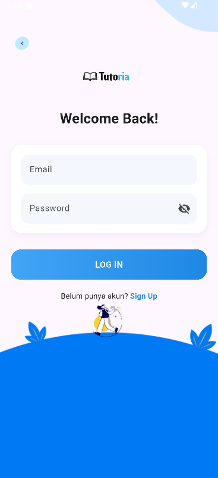
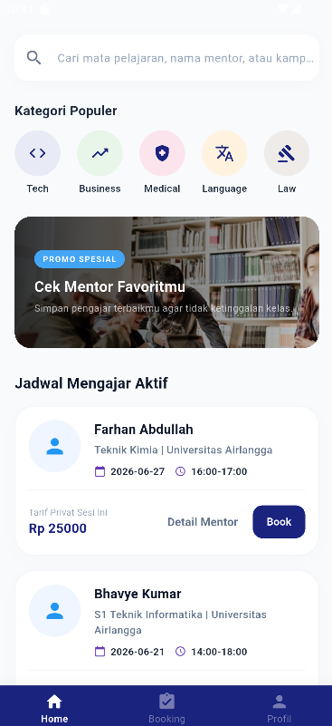
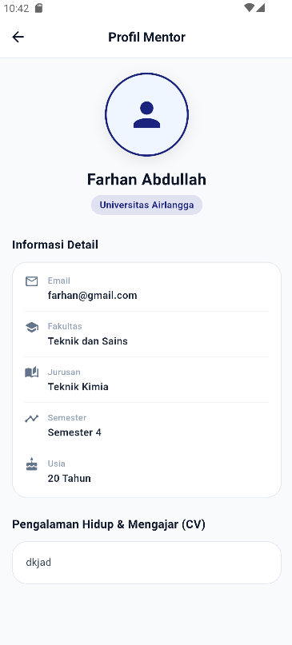

# Tutoria - Aplikasi Mentoring Privat & Katalog Jasa Mentor

Tugas Akhir Pengembangan Aplikasi Mobile menggunakan Flutter dan Firebase.

## 1. Nama dan NPM Anggota Kelompok
1. **Nissa Febriyanti** — NPM: 24082010028
2. **Irfan Baihaqi Jauharul Umam** — NPM: 24082010083
3. **Dhea Iyaasha Putri Budiman** — NPM: 24082010018
4. **Adinda Citra Maylani** — NPM: 24082010032
5. **Putri Anggun Lestari** — NPM: 24082010025 

## 2. Tema Aplikasi
**Katalog Produk Toko (Katalog Jasa Layanan Mentor Pendidikan / EdTech)** — Menyajikan etalase profil mentor privat selayaknya katalog produk, di mana siswa dapat menjelajahi, menyaring, dan memesan jadwal belajar secara terstruktur dan interaktif.

## 3. Deskripsi Singkat Aplikasi
**Tutoria** adalah aplikasi berbasis *mobile* yang mengadaptasi konsep katalog produk toko untuk diterapkan pada penyediaan layanan jasa mentoring privat bagi siswa tingkat Sekolah Dasar (SD) hingga Sekolah Menengah Atas (SMA). Pada aplikasi ini, profil setiap mentor beserta keahlian akademis mereka diposisikan sebagai "produk" yang dikatalogkan secara rapi berdasarkan kategori mata pelajaran populer.

Aplikasi ini memudahkan siswa untuk melakukan eksplorasi portofolio mentor, mulai dari asal kampus (seperti Universitas Airlangga atau Institut Teknologi Sepuluh Nopember), jurusan, fakultas, hingga tarif jasa per sesi. Melalui integrasi teknologi cloud, siswa dapat memesan (*booking*) jadwal bimbingan belajar, memantau riwayat pemesanan yang sukses, hingga membatalkan jadwal secara *real-time*. Proyek ini dirancang untuk menciptakan platform edukasi yang transparan, aman, dan responsif.

## 4. Jenis Firebase yang Digunakan
Aplikasi ini menggunakan jenis database **Firebase Cloud Firestore** (NoSQL Database) untuk melakukan penyimpanan, pembaruan, dan sinkronisasi data transaksi serta katalog mentor secara langsung dan *real-time*. Selain itu, aplikasi juga didukung oleh **Firebase Authentication** untuk manajemen keamanan pendaftaran akun.

## 5. Struktur Koleksi Firebase
Database Firestore pada aplikasi Tutoria memiliki 4 koleksi utama dengan struktur dokumen sebagai berikut:

A. Koleksi users
Deskripsi: Menyimpan data informasi profil lengkap milik pengguna, baik yang berperan sebagai siswa maupun mentor.

Struktur Dokumen:
    {
      "full_name": "STRING",
      "email": "STRING",
      "role": "STRING (student / mentor)",
      "campus": "STRING",
      "faculty": "STRING",
      "major": "STRING",
      "district": "STRING",
      "age": "NUMBER",
      "bio": "STRING",
      "cv_link": "STRING",
      "reason": "STRING",
      "createdAt": "TIMESTAMP"
    }
    ```

B. Koleksi subjects
Deskripsi: Menyimpan daftar kategori mata pelajaran atau bimbingan belajar yang tersedia.

Struktur Dokumen:
    {
      "name": "STRING (Contoh: Ilmu Pengetahuan Sosial SMP)"
    }
    ```

C. Koleksi schedules
Deskripsi: Menyimpan data katalog sesi bimbingan belajar, status ketersediaan jadwal, catatan bimbingan, serta relasi antara akun siswa dan mentor.

Struktur Dokumen:
    {
      "mentor_id": "STRING (Relasi ke UID koleksi users)",
      "student_id": "STRING (Relasi ke UID koleksi users)",
      "student_name": "STRING",
      "student_school": "STRING",
      "student_class": "STRING",
      "note": "STRING",
      "price": "STRING",
      "status": "STRING (Cancelled / Active / Completed)",
      "day": "STRING (YYYY-MM-DD)",
      "time": "STRING (HH:MM-HH:MM)",
      "created_at": "TIMESTAMP"
    }
    ```

D. Koleksi bookings
Deskripsi: Menyimpan rekaman riwayat transaksi pemesanan katalog mentor yang status pembayarannya telah dinyatakan berhasil (success).

Struktur Dokumen:
    {
      "booking_id": "STRING",
      "schedule_id": "STRING (Relasi ke koleksi schedules)",
      "student_id": "STRING (Relasi ke UID koleksi users student)",
      "mentor_id": "STRING (Relasi ke UID koleksi users mentor)",
      "mentor_name": "STRING",
      "mentor_campus": "STRING",
      "mentor_major": "STRING",
      "mentor_image": "STRING",
      "price": "STRING",
      "payment_status": "STRING (success)",
      "day": "STRING (YYYY-MM-DD)",
      "created_at": "TIMESTAMP"
    }
    ```

## 6. Jumlah Data yang Digunakan
Total data yang digunakan di dalam database Firebase Cloud Firestore saat ini adalah **± 45 data (dokumen)** yang tersebar secara proporsional ke dalam empat koleksi utama (`users`, `subjects`, `schedules`, dan `bookings`) untuk keperluan pengujian fungsionalitas aplikasi.

## 7. Fitur Utama Aplikasi
1.  **Sistem Registrasi Akun Berbasis Form Murni:** Halaman pendaftaran akun (*Sign Up*) menggunakan komponen `Form`, `TextFormField`, dan `GlobalKey<FormState>` dengan minimal 2 aturan validasi ketat (Pengecekan kolom kosong, batas minimal 8 karakter kata sandi, dan validasi format alamat surel `@gmail.com`).
2.  **Katalog Mentor Real-Time:** Menampilkan daftar etalase jasa mentor secara dinamis langsung dari Cloud Firestore menggunakan widget `StreamBuilder` dan dipadukan dengan optimalisasi komponen `ListView.builder`.
3.  **Pencarian dan Filter Multi-Parametrik:** Fitur pencarian interaktif untuk menyaring katalog berdasarkan nama mentor, program studi, asal universitas, daerah asal, serta filter cepat melalui kategori menu *subjects*.
4.  **Halaman Detail Deskripsi Data:** Mekanisme navigasi perpindahan halaman dari list beranda menuju ke profil lengkap mentor dengan teknik transfer objek data secara utuh tanpa *loss data*.
5.  **Manajemen Pemesanan Berbasis State:** Penanganan indikator pemuatan informasi (*state loading*) menggunakan `CircularProgressIndicator` serta implementasi pesan umpan balik interaktif berupa `SnackBar` saat transaksi berhasil atau gagal diproses.

## 📸 8. Screenshot Aplikasi

| Halaman Registrasi Form | Halaman Utama (Katalog) | Halaman Detail Mentor |
| :---: | :---: | :---: |
|  |  |  |

## 🛠️ 9. Cara Menjalankan Aplikasi

Ikuti petunjuk di bawah ini untuk menginstal dan menjalankan proyek aplikasi Tutoria di perangkat lokal Anda:

### Persyaratan Awal (Prerequisites)
*   Pastikan **Flutter SDK** versi terbaru sudah terkonfigurasi di laptop Anda.
*   Pastikan perangkat Android fisik (dengan mode USB Debugging aktif) atau Android Emulator sudah terhubung.

### Langkah-Langkah Eksekusi
1.  **Buka Project:**
    Buka folder direktori proyek aplikasi `tutoria` melalui Terminal / Command Prompt atau penyunting kode seperti **Visual Studio Code**.
2.  **Unduh Packages Dependensi:**
    Jalankan perintah berikut di terminal untuk mendownload seluruh package eksternal (Firebase Core, Firestore, Auth, dll.) yang tercatat di `pubspec.yaml`:
```bash
    flutter pub get
    ```
3.  **Periksa File Konfigurasi Firebase:**
    Pastikan file kredensial `google-services.json` yang didapatkan dari Firebase Console sudah diletakkan di dalam folder `android/app/`.
4.  **Jalankan Aplikasi:**
    Ketikkan perintah berikut pada terminal untuk memulai proses kompilasi kode Dart ke dalam arsitektur perangkat Anda:
```bash
    flutter run
    ```